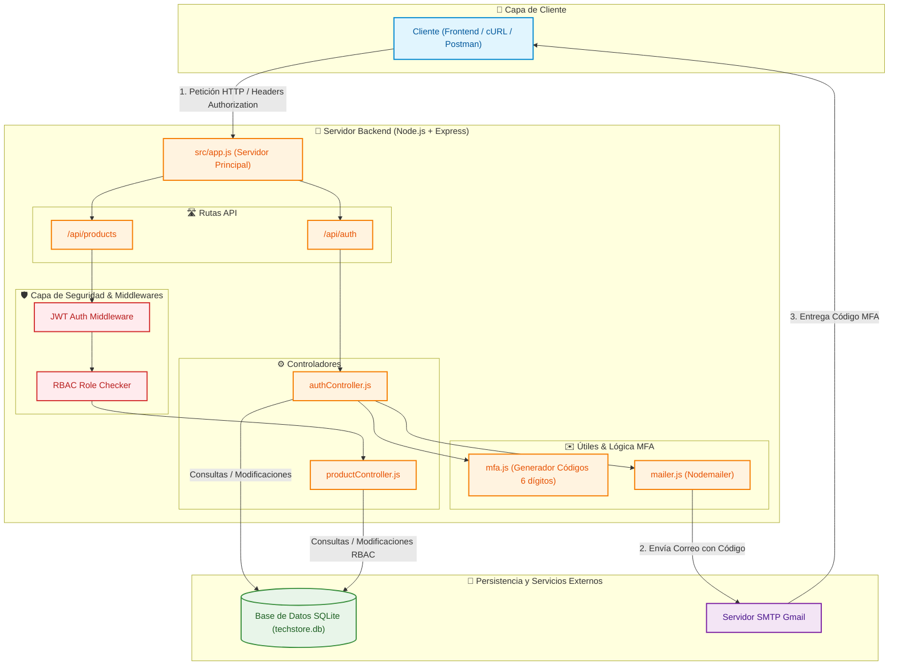

# TechStore - Sistema de Gestión de Inventario

Proyecto de Laboratorio Calificado para la asignatura **Desarrollo de Soluciones en la Nube**.

## 📌 Contexto
TechStore es una cadena de tiendas de tecnología que requiere un sistema centralizado de gestión de inventario con control de acceso basado en roles (RBAC) y seguridad robusta.

## 🛡️ Características de Seguridad
- **Registro e Inicio de Sesión**: Contraseñas con políticas complejas y tokens JWT.
- **Protección Fuerza Bruta**: Bloqueo tras 5 intentos fallidos de login.
- **Autenticación Multi-Factor (MFA)**: Código de 6 dígitos enviado por Email (válido por 5 minutos, máx. 3 intentos).
- **Login Social**: OAuth 2.0 con Google y GitHub.
- **Control de Acceso (RBAC)**: Administrador, Gerente de Tienda, Empleado de Ventas y Auditor.

## 🛠️ Stack Tecnológico
- **Backend**: Node.js / Express
- **Base de Datos**: SQLite / PostgreSQL
- **Autenticación**: JWT, Nodemailer (MFA por Email)

##  🧸 Diagrama de Arquitectura
